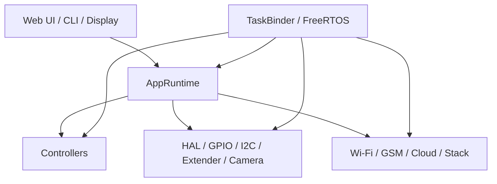
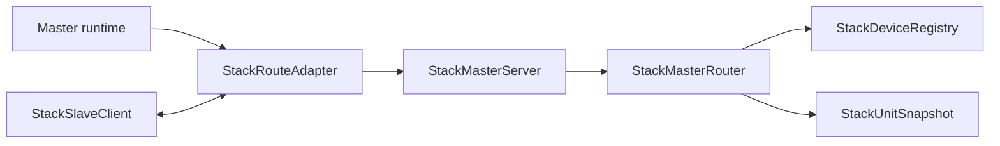
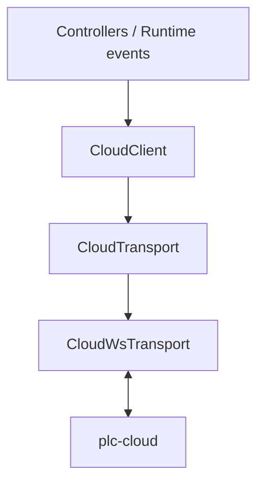
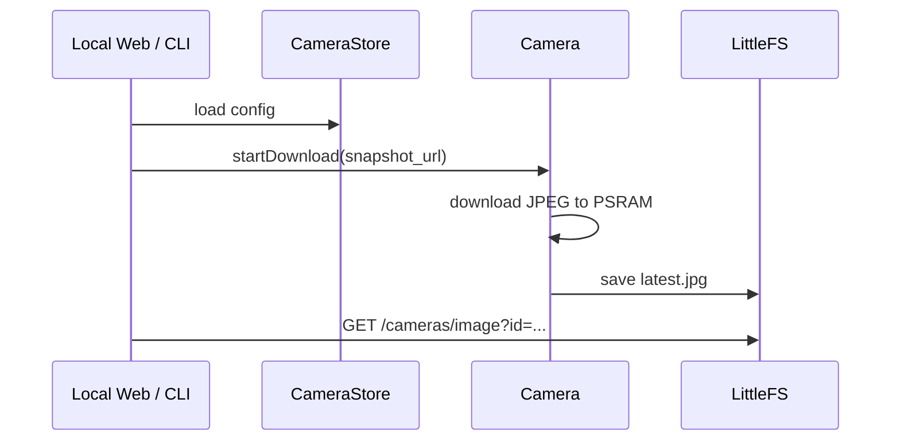
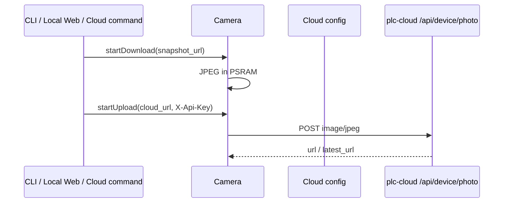
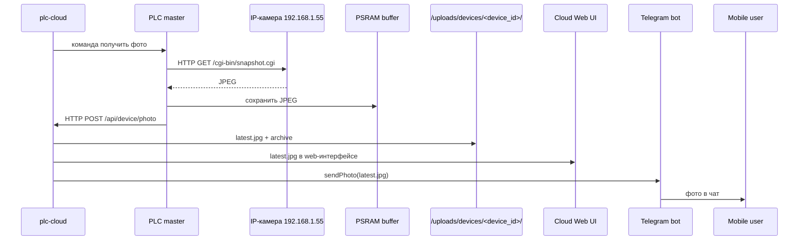

# plc-esp2

Прошивка PLC для ESP32/ESP32-S3 с локальным управлением, RTOS-runtime, stack-сетью master/slave, облаком и локальной камерой/snapshot pipeline.

## 🧭 Документация

- Стек и маршрутизация: [STACK.md](./STACK.md)
- CLI и конфигурация: [CLI.md](./CLI.md)
- Профили плат: `include/boards/`
- Конфиги и runtime-применение: `include/utils/`, `src/utils/`

## ✨ Что умеет проект

- Локальные интерфейсы: `Web`, `CLI`, `Display`
- Контроллеры: `Sockets`, `Lights`, `Meteo`, `Thermo`, `Tanks`, `Septic`, `Security`, `Watering`, `Ring`, `AVR`, `Leak`
- Stack-сеть: `master/slave`, `websocket` или `rs485`, `json/binary`, fallback-режим
- Cloud: device session, события, команды, загрузка фото
- Камеры: локальный список камер на мастере, snapshot в `PSRAM`, upload в `plc-cloud`

## 🧱 Архитектура проекта



### 🔄 Runtime

Текущая оркестрация собрана вокруг `AppRuntime`, а не вокруг старого монолитного `App::loop()`.

- `AppRuntime::init()` поднимает HAL, сети, контроллеры, display/layout, stack bindings
- `TaskBinder` разносит блокирующие и сервисные части по RTOS-задачам
- основной loop больше не выполняет всю логику напрямую, а работает через фазы:
  - `PreNetwork`
  - `PostNetwork`

### 🧵 RTOS-задачи

Типовой набор задач в текущей архитектуре:

- `network_loop`
- `console_loop`
- `wifi`
- `gsm`
- `cloud`
- `telegram`
- `meteo_history`
- `control_loop`
- `plc_scan`
- `extender`
- `display`
- `plc`
- `stack_evt`

Идея простая:

- быстрый контроль и GPIO не должны страдать от сетевых операций
- post-network работа stack выполняется отдельно
- тяжёлые операции камеры/облака не должны жить в critical path контроллеров

## 🌐 Stack: текущая модель

Старый стек с `StackMaster/StackNode/StackCache/StackSlaveHandler` больше не является актуальной моделью проекта. Текущая подсистема собрана так:

- `StackTransport` — базовый транспорт
- `StackMasterServer` — сервер мастера
- `StackMasterRouter` — маршрутизация, auth, отправка route/notify
- `StackSlaveClient` — клиент слейва
- `StackRouteAdapter` — единый верхний слой обмена `request/event/response/notify`
- `StackDeviceRegistry` — онлайн-реестр узлов
- `StackUnitSnapshot` — текущий индекс/снимок состояния узлов



### Stack-конфигурация

Сейчас поддерживаются:

- роль: `master | slave`
- transport: `websocket | rs485`
- payload: `auto | json | binary`
- exchange policy: `auto | direct | poll`
- fallback:
  - `fallback on|off`
  - `fallback_host <host>`
- признак узла:
  - `slave_controller on|off`

Подробности и актуальные схемы: [STACK.md](./STACK.md)

## ☁️ Cloud

Cloud-слой разделён на два уровня:

- `CloudClient` — сессия, протокол, очередь событий, команды
- `CloudTransport` — доставка (`ws` / placeholder `http`)



Что важно:

- контроллеры не шлют в сеть напрямую
- локальные и stack-события попадают в очередь `CloudClient`
- transport можно менять без переписывания бизнес-логики

## 📷 Камеры и фото

На текущей структуре список камер хранится локально на мастере, а не в облаке:

- `Camera` — фоновая загрузка/выгрузка JPEG
- `CameraStore` — локальный конфиг камер (`/cameras.json`)
- локальный web мастера показывает камеры и умеет сделать snapshot
- cloud получает уже готовый JPEG

### Поток локального snapshot



### Поток отправки фото в облако



### 🌍 Схема с IP-камерой



Типовой практический сценарий:

```text
Cloud -> Master: cameras.snapshot
Master -> Camera: GET http://192.168.1.55/cgi-bin/snapshot.cgi
Master -> PSRAM: JPEG buffer
Master -> Cloud: POST /api/device/photo
Cloud -> Storage: /uploads/devices/<device_id>/latest.jpg
```

### Где это в коде

- `include/hal/camera.hpp`
- `src/hal/camera.cpp`
- `include/hal/camera_store.hpp`
- `src/hal/camera_store.cpp`
- `src/core/network/web/handlers/cameras_handler.cpp`

## 🖥️ Web

Локальный web сейчас строится по схеме:

- сначала регистрируются functional handlers
- потом page callbacks

Это важно: страницы нельзя регистрировать раньше обработчиков, иначе начинают ловиться не те роуты.

Основные разделы:

- контроллеры
- облако
- стек
- правила
- пользователи
- камеры

## ⌨️ CLI

CLI разбит на режимы:

- `login:`
- `password:`
- `plc#`
- `plc(config)#`
- `plc(config-<module>)#`

Ключевые актуальные блоки:

- `show ...`
- `socket on|off|toggle`
- `security arm|disarm|status`
- `photo get/upload/cloud/status/clear`
- `config -> stack ...`
- `config -> cloud ...`

Полный актуальный справочник: [CLI.md](./CLI.md)

## 📁 Структура репозитория

- `src/core/runtime/` — orchestration и runtime-фазы
- `src/core/network/stack/` — стек и routing layer
- `src/core/network/cloud/` — cloud client/transports
- `src/core/network/web/` — web handlers/pages/interfaces
- `src/controllers/` — бизнес-логика контроллеров
- `src/hal/` — низкоуровневое железо, шины, camera, extender
- `include/boards/` — board profiles

## 🛠️ Сборка

Основной профиль сейчас: `fcplc`

```bash
pio run -e fcplc
```

Для логов RTOS-метрик:

- включить `TASK_BINDER_RTOS_DEBUG`
- поднять `LOGGER_LEVEL=4`

## 📌 Практические замечания

- большие буферы и кэши лучше держать в `PSRAM`
- русские web-страницы и docs нужно сохранять в `UTF-8`
- в логах использовать `:` вместо `=`
- для stack/cloud/web/CLI менять документацию синхронно с кодом

## 📚 Смежные документы

- Stack: [STACK.md](./STACK.md)
- CLI: [CLI.md](./CLI.md)
