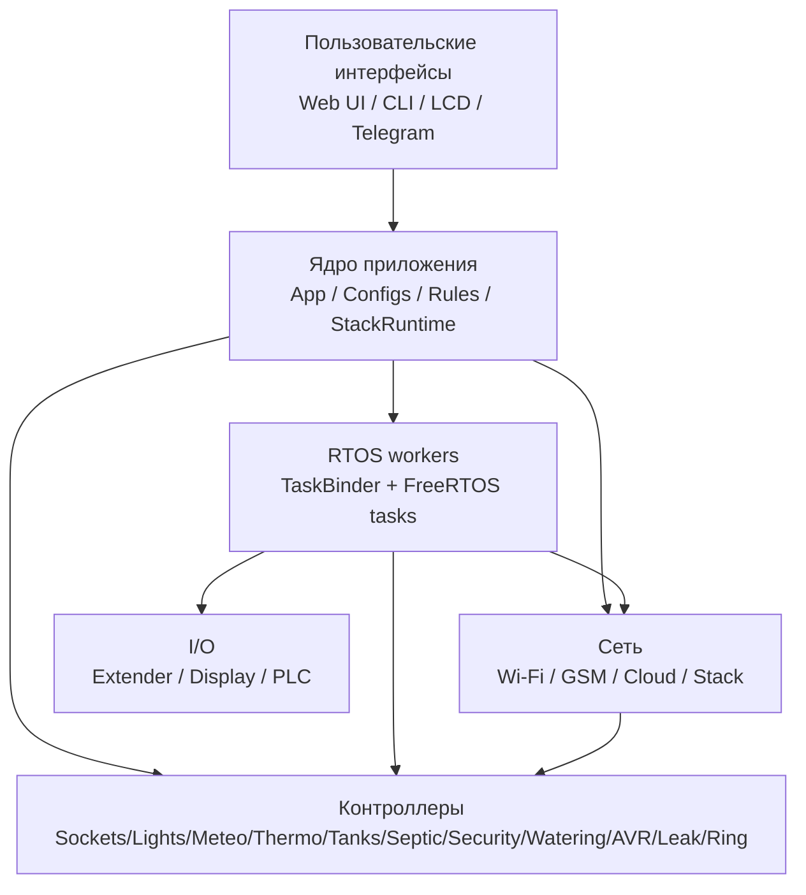
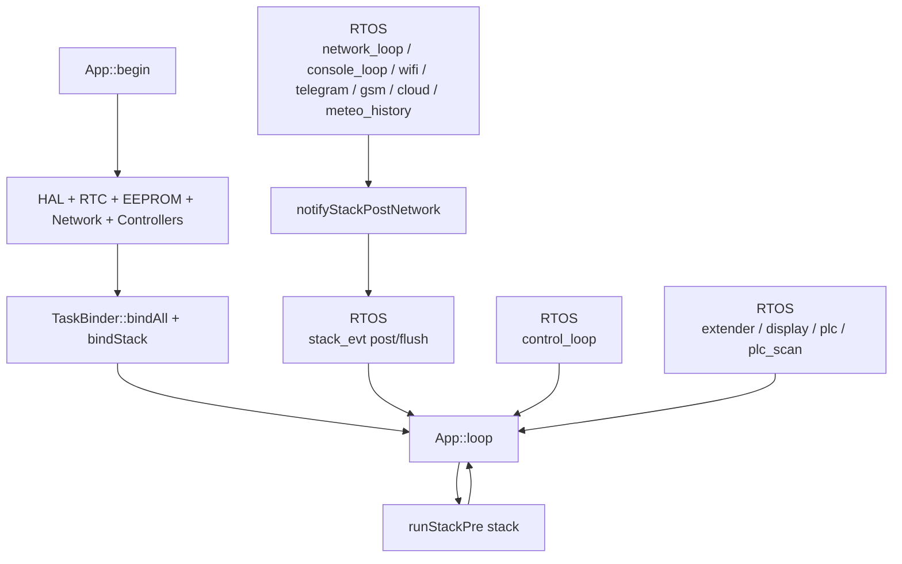

# plc-esp2

Программируемый логический контроллер для микроконтроллеров ESP (семейство ESP32).

`plc-esp2` — прошивка для автоматизации с локальным и распределённым управлением:
- локальное управление (`CLI`, `Web UI`, `LCD`),
- распределённая работа по Stack (`master/slave`),
- интеграции (`Telegram`, `Cloud`, `GSM`),
- набор прикладных контроллеров (розетки, метео, термо, баки, септик, охрана, полив, звонок, АВР, протечки).

## Карта документации

- Подробно про стек, протокол, кэши и синхронизацию: [STACK.md](./STACK.md)
- Полный справочник по CLI-командам: [CLI.md](./CLI.md)
- Окружение сборки: `platformio.ini`, `build.ps1`
- Профили плат и аппаратные маппинги: `include/boards/*`

## Build Profile (fcplc)

- Платформа PlatformIO: `espressif32@6.13.0`
- Framework: `arduino`
- Плата: `4d_systems_esp32s3_gen4_r8n16`
- Включено: `board_build.psram = enabled`
- Ключевые `build_flags`:
  - `TASK_BINDER_RTOS_DEBUG=0`
  - `TASK_BINDER_PLC_SCAN_TICK_MS=5`

## System Overview



## Архитектура runtime



### Runtime после внедрения RTOS

- `App::loop()` теперь в основном оркестрирует фазы, а не выполняет весь тяжёлый runtime сам.
- В отдельные FreeRTOS-задачи вынесены:
  - `network_loop`
  - `console_loop`
  - `wifi`
  - `telegram`
  - `gsm`
  - `cloud`
  - `meteo_history`
  - `stack_evt` (`taskPost/taskFlush`)
  - `control_loop` для контроллеров
- В отдельные RTOS-задачи также вынесены:
  - `extender`
  - `display`
  - `plc`
  - `plc_scan`
- `TaskManager` полностью удалён из runtime.
- Основной `App::loop()` сейчас выполняет только `runStackPre(stack)` (плюс опциональные GPIO-метрики по compile-time флагу).
- `notifyStackPostNetwork()` теперь вызывается из RTOS-задачи `network_loop`; защита pending в `stack_evt` реализована через `std::atomic`.

### Логирование в многозадачном runtime

- После выноса части подсистем в FreeRTOS лог считается многопоточным.
- `Logger` сериализует вывод через mutex и пишет строку логa одним вызовом, чтобы уменьшить риск разрыва строк в UART.
- Если в логах всё ещё появляются артефакты, проверять нужно не только `Logger`, но и прямые `Serial.print`/`printf` в стороннем коде.

### Надёжность I2C/extender (последние изменения)

- В `I2CManager` добавлено мягкое восстановление шины при `probeAddress`-ошибке (clock pulses + STOP), а также timeout на `Wire`.
- На старте `App` логируется карта I2C-проб (`mcp0/mcp1/lcd/eeprom/rtc`) для быстрой диагностики.
- `RTC` и `Display` усилены проверками доступности I2C-устройства; при runtime-сбое `RTC` повторно инициируется при следующем обращении.
- `Extender` теперь при runtime I/O-ошибках помечается как missing и уходит в fast-rescan (ускоренный повторный поиск).
- В `PortIO` включено отложенное применение выходов:
  - до завершения восстановления состояний физические выходы не включаются;
  - после `restoreFromStorage()` выполняются `applyOutputs()` и `setOutputsEnabled(true)`.
## Основные возможности

- Контроллеры автоматизации:
  - `Sockets`, `Lights`, `Meteo`, `Thermo`, `Tanks`, `Septic`, `Security`, `Ring`, `Watering`, `AVR`, `Leak`
- Распределённая работа Stack:
  - роли `master/slave`, fallback-режим, синхронизация кэшей по фичам
- GSM-подсистема:
  - входящие вызовы, SMS/дозвон уведомления, статус регистрации/оператора/сигнала
- Web UI:
  - ACL, локальный и stack-режимы страниц, быстрые действия и формы настройки
  - Admin (`/admin`): RTC, buzzer и флаги EEPROM (`Сохранять`, `Загружать`)
- CLI:
  - иерархические контексты конфигурации, диагностика, управление контроллерами и стеком

## Структура проекта

- `src/app.cpp` — оркестрация приложения, init, главный цикл
- `include/core/task_binder.hpp` — регистрация задач и интервалы выполнения
- `src/core/network/*` — сетевой слой (`Wi-Fi`, `GSM`, `Cloud`, `Stack`)
- `src/controllers/*` — логика контроллеров
- `include/core/network/web/*`, `src/core/network/web/*` — страницы/обработчики/роуты Web
- `include/boards/*` — профили плат, порты, шины, аппаратные ограничения
- `include/utils/*`, `src/utils/*` — конфиги, реестры, вспомогательные утилиты

## Режимы Stack

Устройство может работать как:
- `master` — агрегирует данные slave-узлов в `StackCache`, отдаёт их в Web/Display/Telegram;
- `slave` — исполняет команды master и возвращает `Ack/Err`;
- `fallback` — (опционально) переключение роли при потере связи с master.

Детали протокола и диаграммы обмена см. в [STACK.md](./STACK.md).

## CLI (кратко)

Подсказка: `help`, `?`, `help <topic>`.
Подробный справочник всех команд: [CLI.md](./CLI.md).

### Enable (`plc#`)

- Диагностика:
  - `show board`, `show plc`, `show wifi`, `show time`, `show i2c`, `show ow`, `show ports`, `show config`
- Состояние контроллеров:
  - `show sockets|meteo|thermo|tanks|watering|septic|security`
  - `show <controller> <id>`
- Управление:
  - `socket on|off|toggle <id>`
  - `security status|arm|disarm`
  - `stack nodes`
  - `stack send <id> <get|set> <json>`
  - `stack socket <unit> <on|off|toggle> <id>`
  - `stack thermo <unit> <on|off|toggle> <id>`
  - `stack security <unit> <arm|disarm|status|clear>`
- Система:
  - `write`, `erase`, `wifi restart`, `reload`, `reset`, `ext scan`, `show ext`
- Обновление:
  - `copy tftp://<ip>/firmware.bin firmware`
  - `copy http://<ip>/firmware.bin firmware`

### Config (`plc(config)#`)

- Глобально:
  - `password <pass>` / `admin password <pass>`
  - `stack role <master|slave>`
  - `stack master <host>`
- Контексты:
  - `wifi`, `tgbot`, `cloud`, `time`
  - `socket`, `meteo`, `thermo`, `tank`, `watering`, `septic`, `security`

### Примеры контекстов

- `plc(config-wifi)#`: `ssid`, `password`, `ap on|off`, `ap_ssid`, `ap_password`, `restart`, `show`
- `plc(config-cloud)#`: `enable`, `host`, `port`, `path`, `ssl`, `reconnect`, `event`, `api_key`, `show`
- `plc(config-security)#`: `show`, `enable/disable <id>`, `type <id> <pir|reed>`, `port <id>`, `name <id>`, `silent <id>`, `siren <port|none>`, `keys ...`

## Скриншоты

Telegram:


Web:


Аппаратная часть:


## Пример логов запуска

```text
[1329][INFO][TANK] controller: enabled
[1373][INFO][APP] Configs loaded: /startup-config.json (2492 bytes)
[1374][INFO][WIFI] Mode: STA (SSID=Denisov_VPN)
[1374][INFO][APP] Initializing HAL
[1374][INFO][HAL] I2C init
[1375][INFO][HAL] GPIO init
[1390][INFO][EXT] Extender 0 detected
[1394][INFO][HAL] SPI init
[1394][INFO][HAL] OneWire init
[1395][INFO][HAL] UART init
[1395][INFO][APP] Initializing EEPROM
[1395][INFO][APP] EEPROM used: 0 free: 65536 total: 65536
[1395][INFO][APP] Initializing RTC
[2000-01-02][23:06:37][INFO][APP] Initializing Display
[2000-01-02][23:06:37][INFO][APP] Initializing PLC Control
[2000-01-02][23:06:37][INFO][APP] Initializing Network
[2000-01-02][23:06:37][INFO][STACK] Role: master
[2000-01-02][23:06:37][INFO][CTRL] Sockets init
[2000-01-02][23:06:37][INFO][CTRL] Meteo init
[2000-01-02][23:06:37][INFO][CTRL] Thermo init
[2000-01-02][23:06:37][INFO][CTRL] Tanks init
[2000-01-02][23:06:37][INFO][APP] Application init [OK]
```

## Лицензия

GPLv3. См. [LICENSE](./LICENSE).
