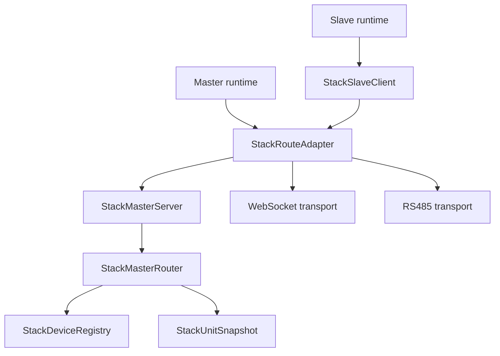
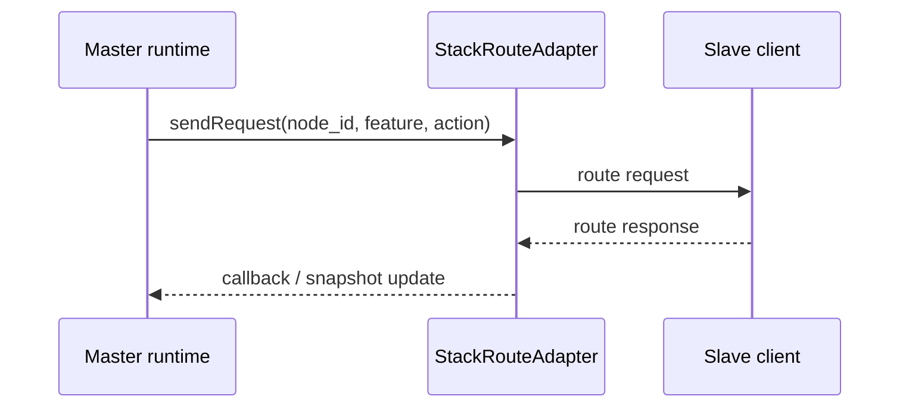
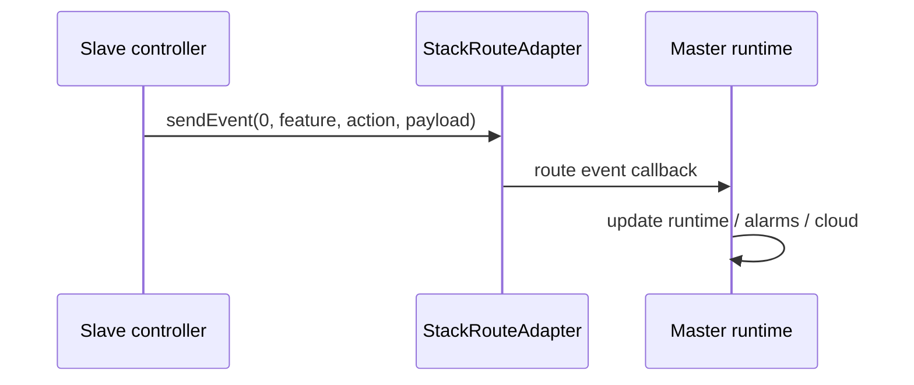
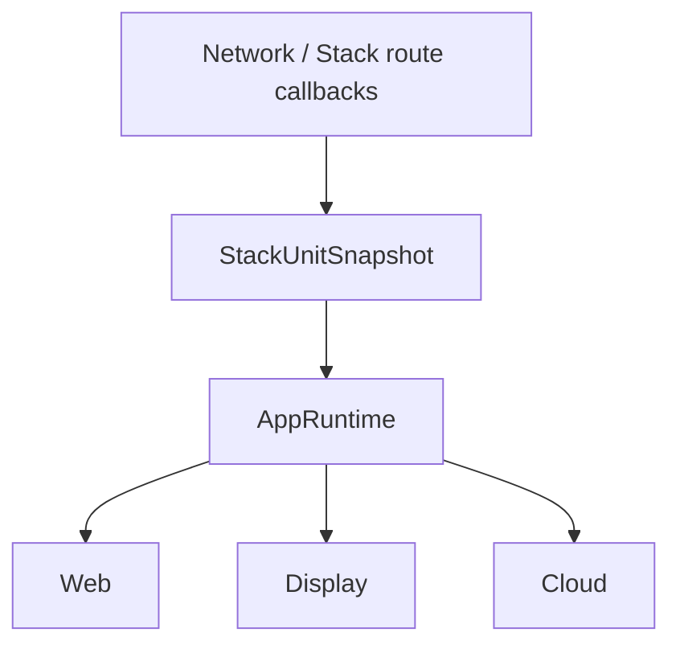
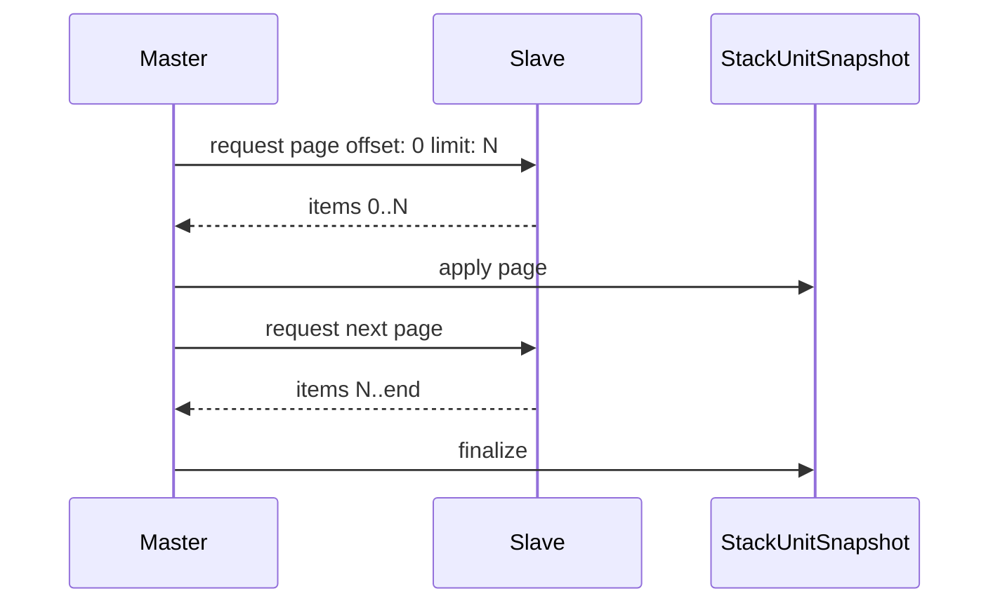

# STACK.md

# 🌐 Stack в plc-esp2

Актуальное описание stack-подсистемы на текущей ветке `develop`.

Этот документ описывает именно текущую структуру проекта:

- `StackTransport`
- `StackMasterServer`
- `StackMasterRouter`
- `StackSlaveClient`
- `StackRouteAdapter`
- `StackDeviceRegistry`
- `StackUnitSnapshot`

Старые сущности вроде `StackMaster`, `StackNode`, `StackCache`, `StackSlaveHandler` и старые TCP-схемы больше не являются источником правды для текущего кода.

Общий обзор проекта: [README.md](./README.md)

## 🧭 Назначение stack

Stack нужен для связи между PLC-узлами в распределённой системе:

- master агрегирует доступные slave-узлы
- slave исполняет входящие команды и отдает snapshot/state
- web/display/rules/cloud на мастере работают не с “сырым сокетом”, а с индексом устройств и снимками состояния

## 🧱 Верхнеуровневая архитектура

## 🧩 Основные компоненты

### `StackTransport`

Базовый транспортный интерфейс. От него ожидается:

- connect/disconnect lifecycle
- text/binary message delivery
- callback-уведомления о событиях транспорта

Фактические реализации:

- websocket
- rs485

### `StackMasterServer`

Серверная часть мастера. Поднимает серверный transport и передает сообщения в router.

Отвечает за:

- запуск мастер-сервера
- binding обработчиков route/notify
- работу в роли master

### `StackMasterRouter`

Центральная точка мастер-маршрутизации.

Отвечает за:

- auth/accept узлов
- регистрацию устройства в `StackDeviceRegistry`
- отправку `text/binary` на нужный `node_id`
- доставку route/event/request/response наверх

### `StackSlaveClient`

Клиентская часть слейва.

Отвечает за:

- подключение к мастеру
- auth/hello
- приём команд и route
- отправку ответов, событий и notify на мастер

### `StackRouteAdapter`

Это текущий верхний API stack-обмена. Вокруг него сейчас строится вся прикладная логика.

Он даёт:

- `sendRequest(...)`
- `sendEvent(...)`
- `sendRoute(...)`
- `sendResponse(...)`
- unified route/notify handling
- payload mode:
  - `json`
  - `binary`
- exchange policy:
  - `direct`
  - `poll`

### `StackDeviceRegistry`

Реестр онлайн-узлов.

Хранит:

- `node_id`
- имя
- IP/transport diagnostics
- caps
- online/offline presence

Используется для:

- web-страницы стека
- определения online/offline
- именования удалённых источников
- bootstrap/sync логики

### `StackUnitSnapshot`

Текущий индекс удалённых данных по узлам.

Это уже не “живой сокетный кэш старого образца”, а snapshot/index слой для удалённых контроллеров:

- `State`
- `CacheState`
- `RequestState`
- страницы данных (`sockets/lights/meteo/thermo/tanks/watering/leak`)
- `rules summary`
- bookkeeping по page requests

Ключевая идея:

- UI и runtime читают из snapshot/index
- route responses обновляют snapshot
- старые/пустые данные не считаются готовыми

## 👑 Роли узла

### Master

Master:

- принимает slave-узлы
- ведет registry
- ведет snapshot/index
- опрашивает удалённые фичи
- отдает stack-данные в web/display/rules/cloud

### Slave

Slave:

- подключается к master
- принимает команды/requests
- возвращает snapshots/state/pages
- шлёт доменные события на мастер

### Fallback

Поддерживается fallback-поведение:

- при потере мастера slave может поднять локальный master
- если указан `fallback_host`, slave переключается на другой мастер вместо локального takeover

## 🔀 Exchange policy и payload mode

CLI/Web конфиг поддерживает:

### Policy

- `direct`
- `poll`

Практический смысл:

- `direct` — упор на прямую доставку/обмен
- `poll` — более выраженный запросный режим

### Payload mode

- `json`
- `binary`

Практический смысл:

- `json` удобно для совместимости и трассировки
- `binary` нужен для более компактного или типизированного обмена
- для `rs485` payload принудительно `binary`

## 📡 Транспорт

Сейчас проект поддерживает два транспортных направления stack:

- `websocket`
- `rs485`

Конфигурация выбирается через:

- CLI
- Web `/stack`
- runtime apply через `ConfigsManager`

### WebSocket heartbeat

Для `websocket` transport сейчас используется симметричный heartbeat:

- `pingInterval: 5000 ms`
- `pongTimeout: 12000 ms`
- `disconnectTimeoutCount: 3`

Это убирает ложные `transport_disconnect` до первого `ping/pong`, но всё ещё быстро ловит реальную потерю канала.

## 🔁 Поток обмена

### Route-запрос/ответ

### Event от slave на master

## 🗂️ Snapshot-индекс

`StackUnitSnapshot` сейчас хранит не всё подряд, а наборы, реально нужные runtime/UI:

- system state
- summary state
- sockets page
- lights page
- meteo page
- thermo page
- tanks page
- watering page
- leak page
- rules summary

И для каждого узла ведёт:

- есть ли данные
- свежесть данных
- pending request
- pending page request
- offset/limit bookkeeping

### Что входит в текущий `system state`

`system snapshot` для stack-юнита сейчас покрывает:

- `rtc`
- `plc`
- `wifi`
- `gsm`

Это нужно, чтобы web/cloud могли показывать вкладку `Сеть` и диагностику не только у локального мастера, но и у слейвов.

### Что входит в текущий `controllers summary`

Сводка по удалённому узлу сейчас покрывает:

- `sockets`
- `lights`
- `meteo`
- `thermo`
- `tanks`
- `septic`
- `watering`
- `security`
- `ring`
- `avr`
- `leak`
- `rules`

Отдельное ограничение текущей реализации:

- `security` в stack сейчас живёт как summary + detect preview
- полного page-cache всех `security sensors` в `StackUnitSnapshot` пока нет

### Почему это важно

Это решает старые проблемы:

- UI не должен считать stale-cache за актуальное состояние
- page request bookkeeping нельзя перетирать временными snapshot-объектами
- partial updates можно применять аккуратно, не ломая всё состояние узла

## 🧠 Интеграция с `AppRuntime`

`AppRuntime` сейчас использует stack так:

- `pollStackCaches_()` — фоновые запросы к stack-feature страницам
- bootstrap sync новых узлов
- display remote slot rendering
- cloud stack events
- alarms/summaries по удалённым узлам

## 📄 Пагинация

Для тяжёлых stack-данных используется page-based sync:

- sockets
- lights
- meteo
- thermo
- tanks
- watering
- leak

Отдельно, без page-потока, синхронизируются:

- `system snapshot`
- `controllers summary`
- `rules summary`
- `security summary + detect preview`

Это важно, чтобы:

- не раздувать payload
- не устраивать burst-запросы
- не ронять parse/latency на больших наборах

### Типовой page-поток

## 🔔 Stack и Cloud

Stack-события теперь могут публиковаться в cloud через master.

Важно:

- master шлёт cloud event с `unit: "stack"` и `node_id`
- в `payload.data` прокидывается `source_name`
- контроллеры не шлют в cloud напрямую, это делает runtime/cloud layer

### Что уже работает и локально, и по stack

На текущем `develop` одинаково для local и stack уже заведены:

- `sockets`
- `lights`
- `meteo`
- `thermo`
- `tanks`
- `security`
- `septic`
- `ring`
- `watering`
- `quick_actions.run`
- `rules.run`

По `watering` стек уже поддерживает:

- `status`
- `force`
- `weekdays`
- `tank`
- `resume`
- `resume_level`
- `time`
- `duration`
- `slot_enabled`

И изменения конфигурации полива, пришедшие по stack, сохраняются на принимающем узле, а не остаются только в RAM.

## 🧪 Диагностика

### `show stack`

CLI показывает:

- `role`
- `master_host`
- `policy`
- `transport`
- `payload`
- `fallback`
- `fallback_host`
- `controller`
- `api_key`
- runtime diagnostics:
  - `state`
  - `master_active`
  - `fallback_active`
  - `online`
  - exchange queue/load counters
  - rs485 counters/state

### Что смотреть при проблемах

1. online/offline узла
2. registry и имя `node_id`
3. свежесть `StackUnitSnapshot`
4. page request stuck / stale data
5. `retried/expired/dropped`
6. `network_lock_held_ms` / `rt_lock_held_ms`
7. `rs485_*` counters при транспортных проблемах
8. причину disconnect: `transport_disconnect`, `auth_failed`, `watchdog`
9. для websocket не путать `transport close` и slave watchdog — это разные источники логов

## ⚠️ Частые ошибки

- Документация/код рассинхронизированы и продолжают ссылаться на старые stack-классы
- page bookkeeping случайно затирается временным snapshot
- UI принимает pending/stale state за финальное состояние
- в docs остаются старые `auto` для stack policy/payload, хотя в текущем коде реально работают только `direct|poll` и `json|binary`
- новые stack feature меняются в runtime, но не синхронизируются с:
  - CLI
  - Web
  - README/STACK docs

## 🛠️ Что менять синхронно при доработке stack

- `ConfigsManager`
- CLI `stack ...`
- Web `/stack`
- `Network`
- `StackRouteAdapter`
- `AppRuntime`
- docs

## 📁 Карта кода

- `include/core/network/stack/stack_transport.hpp`
- `include/core/network/stack/stack_master_server.hpp`
- `include/core/network/stack/stack_master_router.hpp`
- `include/core/network/stack/stack_slave_client.hpp`
- `include/core/network/stack/stack_route_adapter.hpp`
- `include/core/network/stack/stack_device_registry.hpp`
- `include/core/network/stack/stack_unit_snapshot.hpp`
- `src/core/network/stack/`
- `include/core/runtime/app_runtime.hpp`
- `src/core/runtime/`
