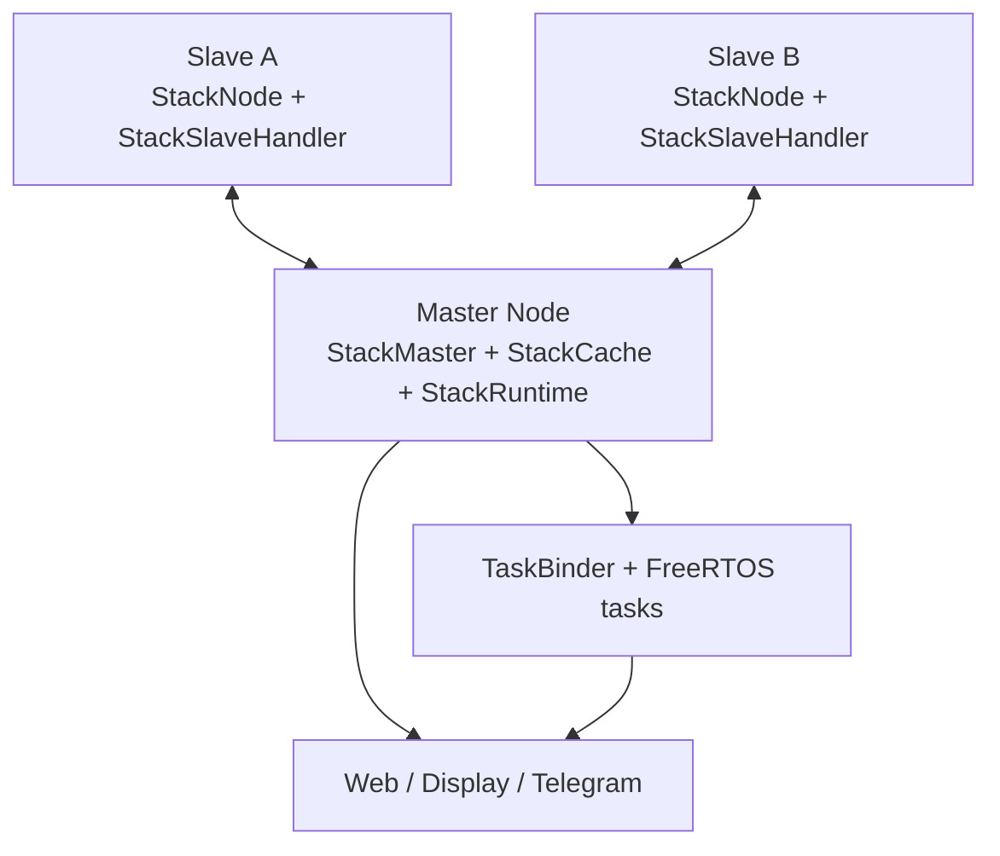
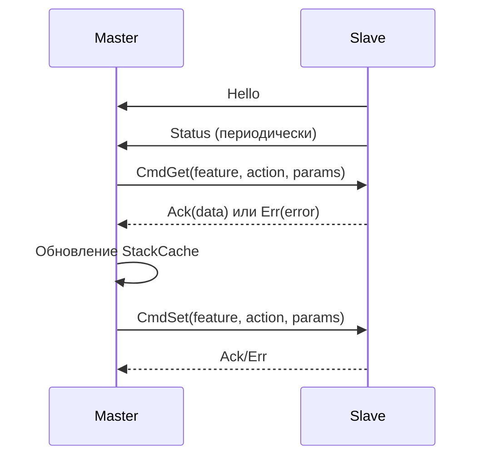
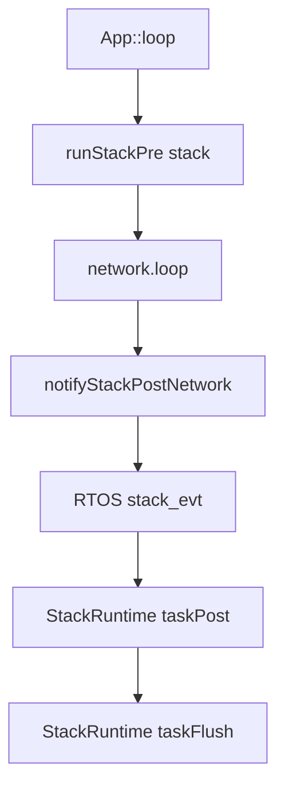
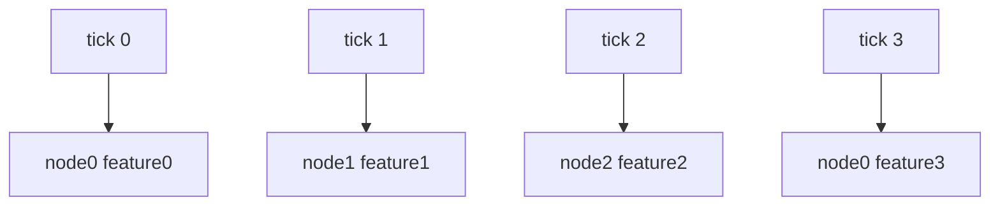
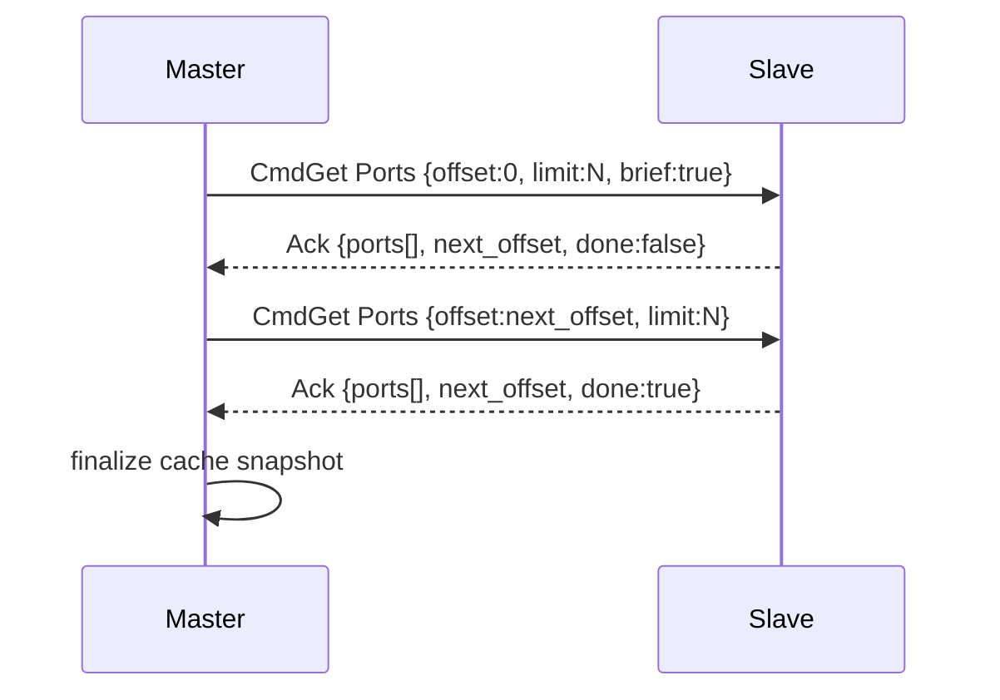

# STACK.md

Подробное описание Stack-подсистемы в `plc-esp2`.

Документ покрывает:
- роли master/slave,
- транспорт и формат frame,
- формат команд/ответов,
- модель кэша и синхронизацию,
- практическую диагностику.

Общая документация проекта: [README.md](./README.md)

## 1. Что такое Stack

Stack — внутренний TCP-протокол обмена между контроллерами.

- `Master`:
  - принимает подключения slave-узлов,
  - опрашивает состояние фич (`CmdGet`),
  - отправляет команды управления (`CmdSet`),
  - агрегирует ответы в `StackCache`,
  - отдаёт данные в Web/Display/Telegram/alarms.
- `Slave`:
  - подключается к master,
  - периодически отправляет `Hello` и `Status`,
  - исполняет входящие `CmdGet`/`CmdSet`,
  - возвращает `Ack`/`Err`.

## 2. Архитектура (верхний уровень)



## 3. Основные компоненты

### Сторона master

- `StackMaster` (`include/core/network/stack/stack_master.hpp`)
  - TCP сервер, таблица сессий
  - привязка сессии к `node_id` из `Hello`
  - `sendTo(node_id, type, payload, len)`
- `StackCache` (`include/core/network/stack/stack_cache.hpp`)
  - кэши фич по узлам
  - request-функции (`request*`)
  - обработка `Ack/Err` и обновление snapshot

### Сторона slave

- `StackNode` (`include/core/network/stack/stack_node.hpp`)
  - TCP клиент, reconnect, heartbeat
- `StackSlaveHandler` (`include/core/network/stack/stack_slave_handler.hpp`)
  - диспетчеризация `CmdGet`/`CmdSet`
  - генерация `Ack`/`Err`
  - remote-кэши для отображения удалённых данных на slave

### Интеграция в App

- `src/app.cpp`
  - `runStackPre(stack)` в основном loop
  - `notifyStackPostNetwork()` после `network.loop()`
  - обработка online/offline
  - логи синхронизации и инвентаризации
- `include/core/task_binder.hpp`
  - `stack_evt` task для `StackRuntime::taskPost/taskFlush`
  - RTOS worker-задачи для network и `control_loop`
  - `display` / `plc` / `extender` пока остаются в cooperative-слое

## 4. Транспортный формат

Кодек: `include/core/network/stack/stack_protocol.hpp`

```text
+---------+---------+------+--------------+-------------------+---------+
| magic   | version | type | length (LE)  | payload (0..1024) | CRC16   |
| 1 byte  | 1 byte  | 1 b  | 2 bytes      | N bytes           | 2 bytes |
+---------+---------+------+--------------+-------------------+---------+
```

- `magic = 0xA5`
- `version = 1`
- `kMaxPayload = 1024`
- CRC16 считается по `[header + payload]`

## 5. Типы сообщений

`StackMsgType`:
- `Hello`
- `Features`
- `Status`
- `CmdSet`
- `CmdGet`
- `Ack`
- `Err`

В рабочем контуре обычно используются: `Hello`, `Status`, `CmdGet`, `CmdSet`, `Ack`, `Err`.

## 6. Идентификация узла (`Hello`)

`StackHello` содержит:
- `node_id`, `proto_ver`, `fw_ver`, `caps`, `name`

Master по `Hello` связывает TCP-сессию с `node_id`.
При конфликте одинаковых `node_id` для разных сессий мастер закрывает старую/конфликтную сессию и логирует конфликт узла.

## 7. JSON-оболочка команд (payload)

### Запрос (`CmdGet` / `CmdSet`)

```json
{
  "cmd_id": 123,
  "feature": 14,
  "action": "get",
  "params": {"id": 1},
  "api_key": "optional"
}
```

### Успех (`Ack`)

```json
{
  "cmd_id": 123,
  "ok": true,
  "feature": 14,
  "action": "get",
  "data": {}
}
```

### Ошибка (`Err`)

```json
{
  "cmd_id": 123,
  "ok": false,
  "feature": 14,
  "action": "get",
  "error": "auth"
}
```

## 8. Последовательность обмена



## 8.1. Runtime-исполнение stack после переноса на RTOS



Ключевые правила:
- `taskPre` остаётся синхронным и вызывается из основного loop.
- На ESP32 `plc_scan.tick()` также остаётся в основном loop (без параллельного RTOS-вызова) из-за общего I2C/Wire доступа.
- `taskPost/taskFlush` выполняются в отдельной RTOS-задаче `stack_evt`.
- Для `stack_evt` используется очередь и pending-защита:
  - новое событие не ставится, пока предыдущее ещё не обработано.
- Такая схема убирает влияние тяжёлых post-network путей на latency локального управления.

## 9. Модель кэша на master

Типовые поля кэша фичи:
- `pending`
- `has_data`
- `last_ok`
- `last_error`
- `updated_ms`
- `item_count`
- `items[]`

Ключевые правила:
- кэш обновляется только через обработку ответов (`Ack/Err`),
- `pending` — состояние запроса, а не признак валидности данных,
- UI должен различать `pending/stale/ready`.

## 10. Фоновый polling

`App::pollStackCaches_()` работает в round-robin, чтобы не создавать burst-запросы.



За тик отправляется один запрос одной фичи.

После переноса на RTOS важно:
- не вызывать `pollStackCaches_()` из нескольких потоков;
- не дублировать `taskPost/taskFlush` одновременно из loop и RTOS worker;
- не слать лишние `stack_evt` notify без pending-флага.
- не выносить читателей общего stack/remote-cache в отдельные RTOS-задачи без синхронизации или snapshot-модели.

## 11. Тяжёлые фичи и постраничная синхронизация

Для больших наборов данных (`Ports`, `TempSensors`) используется page-based pull (`offset/limit`), а не burst multipart.



Плюсы:
- стабильный размер payload,
- меньше ошибок parse,
- устойчивое наполнение селекторов GPIO в вебе.

## 12. Аутентификация

- Master может автоматически добавлять `api_key` в `CmdGet/CmdSet`.
- Slave проверяет ключ (если настроен).
- При несоответствии возвращается `Err("auth")`.

## 13. Диагностика (чеклист)

Если stack ведёт себя нестабильно, проверяй в порядке:

1. события `Unit online` / `Unit offline`
2. ушёл ли request и пришёл ли `Ack/Err`
3. состояние кэша (`pending`, `has_data`, `last_ok`, `last_error`)
4. логи sync (`Sync slave unit ...`, `Sync slave unit complete`)
5. oversized payload (`json parse failed`)
6. конфликты `node_id`
7. RTOS метрики:
   - `stack_evt exec_us / wavg_us / wmax_us`
   - `cloud` пики во время reconnect
   - `telegram` long-poll / reconnect пики

Если локальное управление работает быстро, а `cloud/telegram` имеют большие пики, это нормально при условии, что:
- `stack_evt` остаётся коротким;
- `control_loop` не деградирует по latency.

Текущее безопасное состояние:
- `control_loop` вынесен в RTOS и проверен на slave без observed fatal.
- `display` / `plc` / `extender` возвращены в cooperative execution.
- Причина возврата: при параллельном доступе к shared state и remote-cache у slave возникал риск гонок и фаталов.

## 14. Правила для новых stack-фич

- Не делать массовую отправку `CmdGet` в одном цикле.
- Держать раздельные пути обработки `Ack set` и `Ack get`.
- Для больших данных использовать paging.
- Определять критерий «кэш готов» явно.
- Не подвешивать критичный control-path на network/cloud/tg операции.
- Если новая stack-фича добавляет тяжёлый post-processing, учитывать, что она теперь живёт в `stack_evt` RTOS task.
- Перед выносом UI/display-потребителей в RTOS нужно отдельно решить синхронизацию чтения shared stack/remote-cache.
- Синхронизировать изменения на всех слоях:
  - config
  - stack handler
  - cache
  - web
  - CLI
  - docs

## 15. Карта кода

- Транспорт и codec:
  - `include/core/network/stack/stack_protocol.hpp`
- Базовые типы (`Hello`, `Status`):
  - `include/core/network/stack/stack_types.hpp`
- Перечень фич:
  - `include/core/network/stack/stack_features.hpp`
- Master сервер/сессии:
  - `include/core/network/stack/stack_master.hpp`
- Slave клиент:
  - `include/core/network/stack/stack_node.hpp`
- Обработчик команд на slave:
  - `include/core/network/stack/stack_slave_handler.hpp`
- Кэши и requests на master:
  - `include/core/network/stack/stack_cache.hpp`
- Оркестрация polling/sync:
  - `src/app.cpp`
  - `include/core/task_binder.hpp`
- Ролевая интеграция stack:
  - `src/core/network/network.cpp`

---

Назад к общему описанию: [README.md](./README.md)
